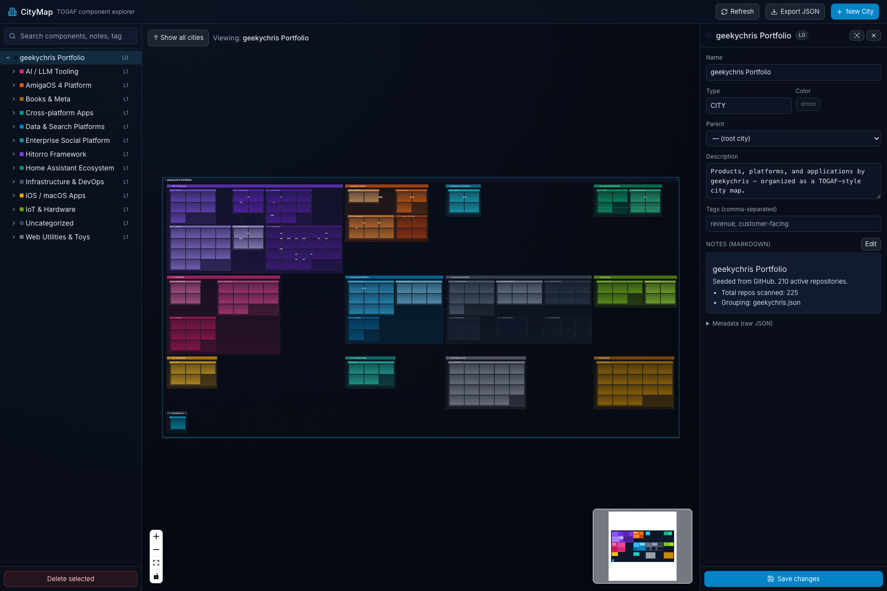
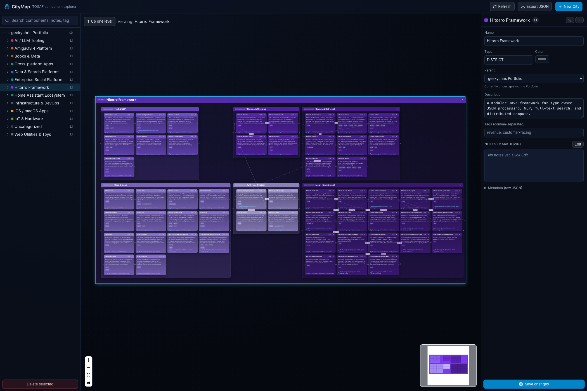
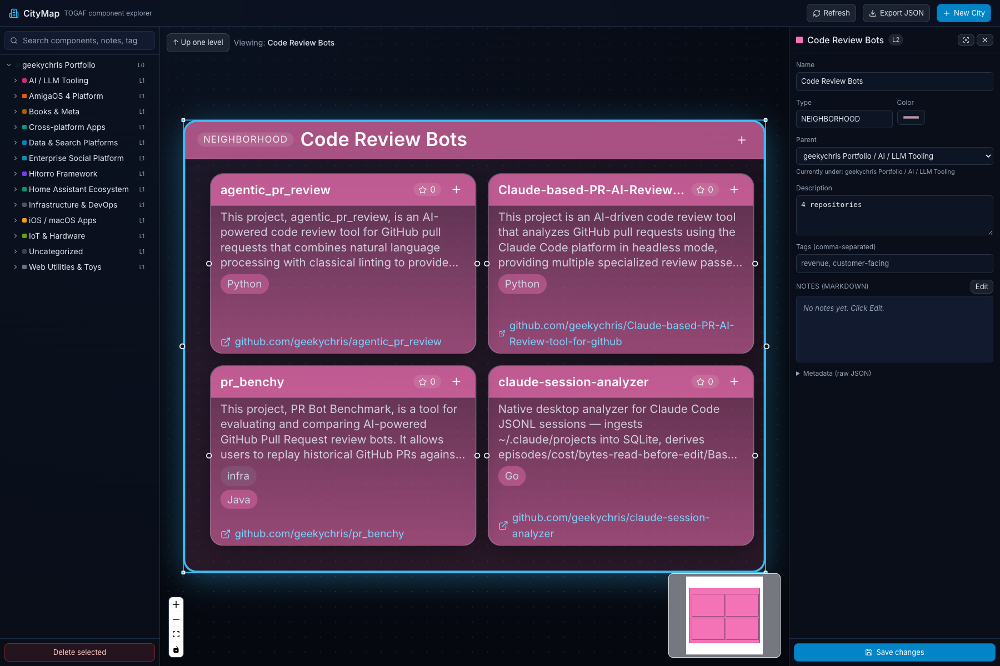
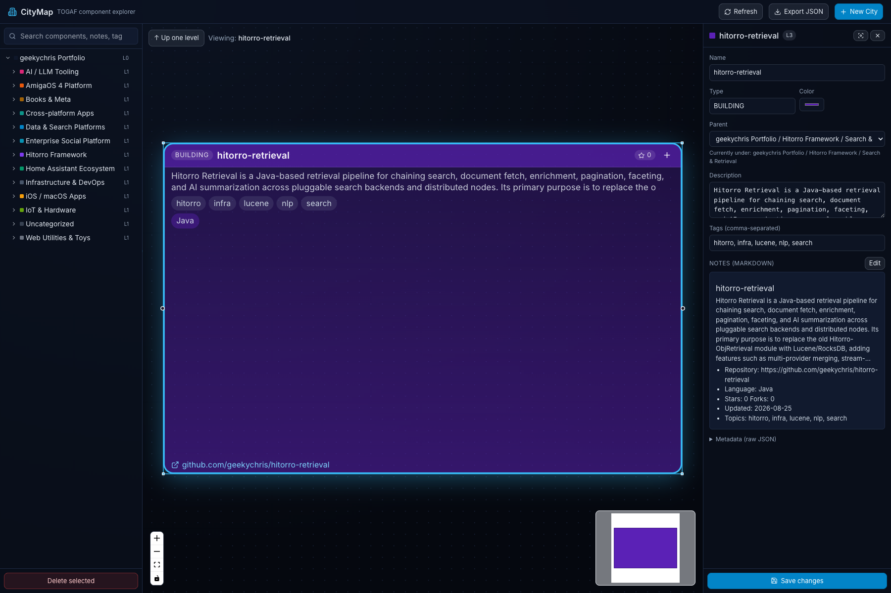

# CityMap

A TOGAF-inspired **city map** editor for enterprise architecture: components nested as
Cities → Districts → Neighborhoods → Buildings → Rooms (L0…Ln), with a pan/zoom canvas,
drag & drop, inline editing, markdown notes, search, cross-cutting dependency edges,
plus a REST API and an MCP server so an AI assistant can read and edit the map too.



Focus into any district to reveal its subsystems, and into any subsystem to see its
components:

|              District view                         |            Neighborhood view                          |               Building detail                       |
| :------------------------------------------------: | :---------------------------------------------------: | :-------------------------------------------------: |
|           |                  |                    |

---

## Table of contents

- [Why this exists](#why-this-exists)
- [What's in the box](#whats-in-the-box)
- [Architecture](#architecture)
- [Quick start](#quick-start)
- [Interacting with the city](#interacting-with-the-city)
- [Populating the map](#populating-the-map)
- [Exporting](#exporting)
- [REST API](#rest-api)
- [MCP server](#mcp-server)
- [Data model](#data-model-sqlite)
- [Extending](#extending)
- [Zoom-detail test](#zoom-detail-test)
- [Configuration](#configuration)
- [Troubleshooting](#troubleshooting)
- [Roadmap](#roadmap-ideas)
- [License](#license)

---

## Why this exists

Enterprise architects use the "city planning" metaphor to reason about large systems:
capabilities become **districts**, systems become **neighborhoods**, applications become
**buildings**, and modules become **rooms**. CityMap gives that mental model a real
canvas you can pan/zoom/edit, so a portfolio of dozens or hundreds of components stays
navigable instead of collapsing into a slide deck.

It also treats the map as **data**: everything is behind a REST API and an MCP server,
so scripts (and AI agents) can materialise, evolve, and query the model the same way a
human can.

---

## What's in the box

| Piece            | Stack                                                   | Port |
| ---------------- | ------------------------------------------------------- | ---- |
| `backend/`       | Spring Boot 3 · Java 21 · SQLite (via JDBC)             | 8088 |
| `frontend/`      | Vite · React 18 · TypeScript · React Flow · Tailwind    | 5173 |
| `mcp-server/`    | Node · `@modelcontextprotocol/sdk` (stdio)              | –    |
| `scripts/`       | `import-github.mjs` (seed) + `test-zoom-detail.mjs` (e2e) | –    |
| `docs/`          | Screenshots + extended docs                             | –    |

---

## Architecture

```
                       ┌──────────────────────────────────────────┐
                       │  Browser (Vite + React + React Flow)     │
                       │  · pan/zoom canvas                       │
                       │  · nested tree + search                  │
                       │  · detail panel (markdown notes)         │
                       └──────────────────────────────────────────┘
                             │  fetch /api/*  (proxy via vite.config)
                             ▼
┌──────────────┐       ┌──────────────────────────────────────────┐
│  MCP client  │◀────▶│  Node MCP server (stdio)                 │
│ (Claude etc.)│       │  · list/get/create/update/delete tools   │
└──────────────┘       │  · search / connect / export             │
                       └──────────────┬───────────────────────────┘
                                      │  HTTP
                                      ▼
                       ┌──────────────────────────────────────────┐
                       │  Spring Boot backend (Java 21)           │
                       │  · REST controllers                      │
                       │  · Component + Connection repositories   │
                       │  · SQLite with foreign_keys=on           │
                       │  · JSON metadata columns                 │
                       └──────────────┬───────────────────────────┘
                                      │
                                      ▼
                       ┌──────────────────────────────────────────┐
                       │  ./citymap.db  (a portable SQLite file)  │
                       └──────────────────────────────────────────┘
```

The **importer** (`scripts/import-github.mjs`) and **e2e test** (`scripts/test-zoom-detail.mjs`)
talk to the REST API the same way the frontend does. Everything is behind the same
contract, so any other client (a CI job, a CLI, a scheduled sync) can drive the model
without going through the UI.

---

## Quick start

```bash
# 1. Backend
cd backend
mvn package
java -jar target/citymap-backend-0.1.0.jar        # → http://localhost:8088

# 2. Frontend (in another shell)
cd frontend
npm install
npm run dev                                       # → http://localhost:5173

# 3. Seed a demo city from GitHub (optional)
cd scripts && npm install
node import-github.mjs geekychris                 # any username works
#   set GITHUB_TOKEN for higher API rate limits
```

Open `http://localhost:5173`.

**Database file** lives at `backend/citymap.db` — a portable SQLite file you can back
up, copy, or diff. Override with `CITYMAP_DB=/some/path.db java -jar ...`.

**Note on ports** — if `8080` (default Spring) or `5173` (default Vite) is already
taken on your machine, they're overridable: `CITYMAP_PORT=8090 java -jar ...` and Vite
will auto-pick the next free port; make sure the two match up via the proxy in
`frontend/vite.config.ts`.

---

## Interacting with the city

- **Left tree** — click to select, double-click to focus into a subtree.
- **Search box** in the sidebar filters by name, description, notes, and metadata.
- **Canvas**
  - Drag any node to reposition (auto-saves on drop, debounced).
  - Grab a corner to resize (auto-saves).
  - **Double-click a node's title** to rename inline. Enter to commit, Esc to cancel.
  - **Double-click the node body** to focus into it (nested view).
  - Click `+` on a header to add a child.
  - Drag from the right handle of one node to the left handle of another to create a
    dependency edge (**Connection**). Pick its `kind` (`uses`, `depends_on`, `calls`,
    `publishes_to`, …) in the detail panel.
- **Detail panel** (right) — name, type, color, parent, description, tags,
  markdown notes with live preview, and raw metadata JSON.
- **Top bar** — Export the whole city to JSON, or start a new city.

Default type hierarchy follows the TOGAF "city planning" metaphor:

| Level | Type          | Meaning                                 |
| ----- | ------------- | --------------------------------------- |
| L0    | CITY          | Enterprise                              |
| L1    | DISTRICT      | Business capability / domain            |
| L2    | NEIGHBORHOOD  | System / bounded context                |
| L3    | BUILDING      | Application                             |
| L4    | ROOM          | Component / module                      |

Types are free-form strings — override them per-node in the detail panel.

### Semantic zoom

Nodes reveal detail as they get bigger on screen. Levels have different font sizes so
district labels stay readable at fitView, and individual buildings show progressively
more content — title only, then description, then tag chips, then language chip +
clickable repo link — as their on-screen width grows. When you focus into a leaf
building it inflates to a 720×460 detail card so every field renders even if the
underlying DB size is small.

### Layout ordering

Sibling nodes are re-ordered at import time so that connected pairs land adjacent in
the grid. This uses a greedy hub-first traversal followed by a 2-opt local search that
minimises total Chebyshev distance across connected pairs. On the seed dataset, the
average distance between connected repos is **~1.04 grid cells** (essentially adjacent).

---

## Populating the map

### From GitHub — product-oriented (recommended)

Drop a JSON grouping at `scripts/groupings/<username>.json` or pass `--grouping <file>`:

```json
{
  "cityName": "geekychris Portfolio",
  "cityDescription": "…",
  "products": [
    {
      "name":  "Hitorro Framework",
      "color": "#7c3aed",
      "description": "A modular Java framework …",
      "subsystems": [
        { "name": "Core & Base", "color": "#a78bfa",
          "repos": ["hitorro-core", "hitorro-base"] },
        { "name": "Mesh",         "color": "#4c1d95",
          "repos": ["hitorro-mesh-core", "hitorro-mesh-driver"] }
      ]
    }
  ],
  "connections": [
    { "from": "hitorro-search-ui", "to": "hitorro-fleet-retrieval",
      "kind": "calls", "label": "BFF" }
  ]
}
```

The importer creates: **CITY → DISTRICT** (per product) **→ NEIGHBORHOOD** (per
subsystem) **→ BUILDING** (per repo). Repos not named in the grouping go into an
`Uncategorized` district sub-grouped by language.

```bash
node scripts/import-github.mjs geekychris                 # uses geekychris.json
node scripts/import-github.mjs someone --grouping=./x.json
```

### From GitHub — language-only (fallback)

Without a grouping file, the importer falls back to one district per primary language
using GitHub's canonical language palette:

```bash
GITHUB_TOKEN=ghp_xxx node scripts/import-github.mjs someone   # avoid rate limits
```

### From your own data

Anything that can POST JSON at `/api/components` and `/api/connections` can populate the
map. See the [REST API](#rest-api) below — the importer is just a couple of hundred lines
of Node using `fetch()`.

Or, hand-craft a JSON blob and load it via `POST /api/import` (the same format
`GET /api/export` produces):

```bash
curl -s http://localhost:8088/api/export > backup.json
curl -X POST http://localhost:8088/api/import?replace=true \
  -H content-type:application/json --data @backup.json
```

---

## Exporting

Two export formats, both first-class:

### 1. Portable JSON  →  `GET /api/export`

`{version, components, connections}`. Re-importable with `POST /api/import`. Also the
"Export JSON" button in the top bar.

### 2. Self-contained HTML  →  `GET /api/export/html`

One file, zero dependencies, includes all styling + a small JS runtime + the data
inlined. Pan (drag), zoom (wheel / trackpad), keyword search, click a component for
its detail panel, double-click to drill in, Esc to zoom out. Same colours, semantic
zoom, and dependency edges as the live app. Email it, host it on S3, or open it
straight off disk.

**Live example in this repo:** [`examples/geekychris-citymap.html`](examples/geekychris-citymap.html)
— clone the repo and open it, or download the raw file and open with `file://`.

Trigger it three ways:

| Where       | How                                                                 |
| ----------- | ------------------------------------------------------------------- |
| UI          | Top bar → **Export HTML** button                                    |
| curl        | `curl -o city.html http://localhost:8088/api/export/html`           |
| CLI (Node)  | `cd scripts && npm run export:html` → writes `citymap.html`         |

If you edit the export renderer at `scripts/lib/render-html-export.mjs`, run
`npm run gen:backend-template` to regenerate `backend/src/main/resources/export/city-template.html`
so the backend serves the new version too.

---

## REST API

Base URL: `http://localhost:8088/api`. All bodies are JSON.

| Method | Path                              | Description                                     |
| ------ | --------------------------------- | ----------------------------------------------- |
| GET    | `/components`                     | List all components (or `?parentId=` for children) |
| GET    | `/components/{id}`                | Get one                                         |
| GET    | `/components/{id}/subtree`        | Component + all descendants (BFS order)         |
| GET    | `/components/{id}/children`       | Immediate children                              |
| POST   | `/components`                     | Create — `{name, parentId?, type?, level?, x?, y?, width?, height?, color?, description?, notes?, metadata?}` |
| PATCH  | `/components/{id}`                | Partial update (only non-null fields applied)   |
| DELETE | `/components/{id}`                | Delete (cascades)                               |
| PATCH  | `/components/{id}/position`       | Move & optionally resize — `{x, y, width?, height?}` |
| POST   | `/components/{id}/move`           | Reparent — `{parentId}` (empty string = root)   |
| GET    | `/search?q=&type=&level=&limit=`  | Full-text search over name/description/notes/metadata |
| GET    | `/connections`                    | List all (or `?componentId=` for one component's) |
| POST   | `/connections`                    | Create — `{sourceId, targetId, kind?, label?}` |
| PUT    | `/connections/{id}`               | Update                                          |
| DELETE | `/connections/{id}`               | Delete                                          |
| GET    | `/export`                         | Full JSON export: `{version, components, connections}` |
| GET    | `/export/html?download=&title=`   | Self-contained interactive HTML export        |
| POST   | `/import?replace=false`           | Bulk import (preserves parent relationships via id remapping) |

Reparenting into your own subtree returns `400`. FK integrity is enforced by SQLite
(`foreign_keys=on`), so deleting a container cascades to its whole subtree and its
connections.

---

## MCP server

Wraps the REST API over stdio so Claude Desktop / Claude Code can browse and edit the
city as a first-class tool.

Add to your MCP client config:

```json
{
  "mcpServers": {
    "citymap": {
      "command": "node",
      "args": ["/absolute/path/to/citymap/mcp-server/index.js"],
      "env": { "CITYMAP_API": "http://localhost:8088" }
    }
  }
}
```

Available tools:

- `list_components`, `get_component`, `get_subtree`
- `create_component`, `update_component`, `delete_component`, `move_component`
- `search_components`
- `list_connections`, `add_connection`, `delete_connection`
- `export_city`

The backend must be running for the MCP server to answer calls.

---

## Data model (SQLite)

Two tables — `component` (self-referential parent, world x/y/width/height, JSON
`metadata`, markdown `notes`) and `connection` (source/target FK with cascade delete,
kind, label):

```sql
CREATE TABLE component (
    id           TEXT PRIMARY KEY,
    parent_id    TEXT REFERENCES component(id) ON DELETE CASCADE,
    name         TEXT NOT NULL,
    type         TEXT NOT NULL,           -- CITY | DISTRICT | ... | free-form
    level        INTEGER NOT NULL,         -- L0..Ln
    x, y, width, height  REAL NOT NULL,   -- world coords
    color, icon, description, notes  TEXT,
    metadata     TEXT NOT NULL DEFAULT '{}',  -- arbitrary JSON blob
    created_at, updated_at  TEXT NOT NULL
);

CREATE TABLE connection (
    id           TEXT PRIMARY KEY,
    source_id    TEXT NOT NULL REFERENCES component(id) ON DELETE CASCADE,
    target_id    TEXT NOT NULL REFERENCES component(id) ON DELETE CASCADE,
    kind         TEXT NOT NULL DEFAULT 'uses',
    label        TEXT,
    metadata     TEXT NOT NULL DEFAULT '{}',
    created_at   TEXT NOT NULL
);
```

Schema lives in `backend/src/main/resources/db/migration/V1__schema.sql` and is applied
idempotently on boot.

---

## Extending

CityMap is intentionally small and unopinionated so you can adapt it. Common extension
points:

### 1. New levels or type names

`level` is just an integer and `type` is a free-form string. The defaults are pinned in
two places if you want to change the palette or add L5:

- **Backend service defaults** — `backend/src/main/java/com/citymap/service/ComponentService.java`
  (`DEFAULT_TYPES`, `DEFAULT_COLORS`).
- **Frontend header styling per level** — `frontend/src/components/ComponentNode.tsx`
  (`HEADER_STYLE[level] = { fontSize, padY, padX, badgeSize }`). Add a row for `5` if
  you want L5 rooms styled differently.

### 2. New edge kinds

Edges have a free-form `kind` (`uses`, `depends_on`, `calls`, `publishes_to`, `extends`,
`packages`, …). The frontend renders animated/dashed strokes for a couple of kinds — add
your own in `frontend/src/components/CityCanvas.tsx` where edges are built:

```ts
animated: c.kind === 'calls' || c.kind === 'depends_on',
style:    { strokeDasharray: c.kind === 'depends_on' ? '4 4' : undefined },
```

### 3. Custom node renderers

`nodeTypes` in `CityCanvas.tsx` currently registers a single `component` renderer. Add a
new one if you want (say) a rack node for L4 rooms, or a special skyline for cities:

```ts
const nodeTypes = {
  component: ComponentNode,
  rack: RackNode,     // your own
}
```

Then map to it in the `rfNodes` memo based on `level` or `type`.

### 4. A new importer

The GitHub importer is ~400 lines of `fetch()` calls against `/api/components` and
`/api/connections`. Copy it and adapt to any source — Jira epics, service catalog,
Confluence spaces, whatever you already have — as long as it produces:

- A tree of things (each with a parent ref, name, description, metadata)
- A set of dependency edges between things

Look at `scripts/import-github.mjs`. The bottom-up sizing (`packGrid` + `orderByConnectivity`)
is reusable — export it from a shared module if you write multiple importers.

### 5. Grouping files

You don't have to put a grouping file next to the importer; drop it anywhere and pass
`--grouping <path>`. The shape is stable — see the JSON snippet in
[Populating the map](#populating-the-map).

### 6. Alternative persistence

Swap SQLite for Postgres by:
1. Update `spring.datasource.url` in `backend/src/main/resources/application.yml`.
2. Add `org.postgresql:postgresql` to `backend/pom.xml`.
3. Port the JSON-blob columns to `jsonb` if you want indexed querying.

The repositories use raw `JdbcTemplate`, so only string quoting and type mapping change.

### 7. Auth / multi-user

Currently single-user, no auth. Sensible next steps:
- Add Spring Security with an OIDC provider.
- Scope each city to an owner column and filter by principal.
- Add a `citymap_id` column to component/connection if you want multiple cities per user.

### 8. Custom UI panels

The right-hand detail panel (`frontend/src/components/DetailPanel.tsx`) is one place; the
sidebar (`Sidebar.tsx`) is another. Both read the same React Query cache, so adding a
new tab in the detail panel or a new pane in the sidebar is straightforward.

---

## Zoom-detail test

`scripts/test-zoom-detail.mjs` is a puppeteer-driven e2e check that opens the running
app in the real system Chrome, focuses each level of the hierarchy in turn, and asserts
that the level-appropriate content actually renders in the DOM:

| Level        | Slots asserted                                                    |
| ------------ | ----------------------------------------------------------------- |
| CITY         | title, `CITY` badge                                               |
| DISTRICT     | title, `DISTRICT` badge                                           |
| NEIGHBORHOOD | title, `NEIGHBORHOOD` badge                                       |
| BUILDING     | title, description (>30 chars), tag chip, language chip, repo link |

Plus a **grid-distance assertion**: for every connection whose endpoints share a
parent, it measures the Chebyshev distance in the grid and fails if `avg > 1.5` or
`max > 3`. This is the regression bar for the layout-ordering algorithm.

```bash
cd scripts
npm install               # first time only
npm test
```

Screenshots for each level land in `/tmp/citymap-test-*.png`. Override the Chrome
binary with `--chrome=/path/to/chrome` if you're not on macOS.

---

## Configuration

| Env var         | Default              | Where                              |
| --------------- | -------------------- | ---------------------------------- |
| `CITYMAP_PORT`  | `8088`               | backend HTTP port                  |
| `CITYMAP_DB`    | `./citymap.db`       | SQLite file path                   |
| `CITYMAP_API`   | `http://localhost:8088` | MCP server & import script      |
| `GITHUB_TOKEN`  | (unset)              | Optional PAT for the GitHub importer |

CORS defaults to `http://localhost:5173,http://localhost:4173`; override with
`citymap.cors.origins` in `application.yml` or the equivalent env variable.

---

## Troubleshooting

- **Backend fails to bind port** — some other process holds 8088; run
  `CITYMAP_PORT=8090 java -jar ...` and update the Vite proxy in
  `frontend/vite.config.ts`.
- **Frontend can't reach `/api`** — Vite proxies `/api` to `http://localhost:8088`; make
  sure the backend is up first.
- **Vite picks 5174 instead of 5173** — 5173 was taken by another dev server; either
  free 5173 or just open 5174.
- **MCP client says `unknown protocolVersion`** — upgrade the client to a build that
  supports the current MCP protocol.
- **`npm test` can't find Chrome** — pass `--chrome=/path/to/chrome` or set the
  `CITYMAP_CHROME` env var if you patch the script for it.

---

## Roadmap ideas

- Persist canvas viewport (last-viewed subtree) per user.
- Right-click context menu on nodes.
- Diff view between two exports (architectural drift over time).
- More edge kinds with distinct visual styles.
- Multi-user auth + shared editing.
- Postgres option with GIN indexes on the metadata JSON.
- WebSocket live updates so multiple clients stay in sync.

---

## License

MIT — see [`LICENSE`](LICENSE).
